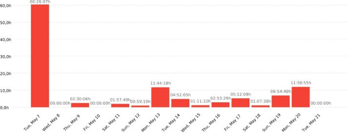
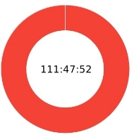

Universidad de Sevilla

Escuela Técnica Superior de Ingeniería Informática

WPL

BanquetBuddy

**Time Effort report**

Grado en Ingeniería Informática – Ingeniería del Software Ingeniería del Software y Práctica Profesional

Curso 2023 – 2024

|**Fecha**|**Versión**|
| :-: | :-: |
|20/05/2024|2\.0|

|**Grupo de prácticas: 8**|
| :-: |
|Alberto Benitez Morales - Escritura datos de tiempo en Clockify|
|Álvaro Carrera Bernal - Escritura datos de tiempo en Clockify|
|Álvaro Navarro Rivera - Escritura datos de tiempo en Clockify|
|Álvaro Jose Sanchez Flores - Escritura datos de tiempo en Clockify|
|Artemio Rodriguez Asensio - Escritura datos de tiempo en Clockify|
|Eduardo de Bustamante Lucena - Escritura datos de tiempo en Clockify|
|Fernando Barroso Barroso - Escritura datos de tiempo en Clockify|
|Francisco Jose Vargas Castro - Escritura datos de tiempo en Clockify|
|Gonzalo Santigo Martín - Escritura datos de tiempo en Clockify|
|Guillermo Alonso Pacheco Rodrigues - Escritura datos de tiempo en Clockify|
|Jaime Caballero Hernandez - Escritura datos de tiempo en Clockify|
|
Javier Nunes Ruiz - Escritura datos de tiempo en Clockify, creación gráficas, escritura

documento
|
|Javier Rodríguez Cordero - Escritura datos de tiempo en Clockify|
|Juan Martínez Cano - Escritura datos de tiempo en Clockify|
|Marco Antonio Roca Rodríguez - Escritura datos de tiempo en Clockify|
|Mario Sanchez Naranjo - Escritura datos de tiempo en Clockify|
|Pablo Martínez Valladares - Escritura datos de tiempo en Clockify|

|**Fecha**|**Versión**|**Descripción**|
| :- | :- | :- |
|04/03/2024|1\.0|Primera versión del documento|
|10/03/2024|1\.1|Actualización valores gráficas y mayor análisis|
|12/03/2024|1\.2|Actualización completa semana 6|
|27/03/2024|1\.3|Actualización completa semana 7|
|01/04/2024|1\.4|Actualización completa semana 8 + SS|
|09/04/2024|1\.5|Actualización completa semana 9|
|22/04/2024|1\.6|Actualización completa semana 10 + feria|
|01/05/2024|1\.7|Actualización completa semana 11|
|06/05/2024|1\.8|Actualización completa semana 12|
|19/05/2024|1\.9|Actualización completa semana 13|
|20/05/2024|2\.0|Actualización completa semana 14|

[REPORTES DE TIEMPOS**	**4**](#_bookmark0)**

[Gráfico horas/semana	4](#_bookmark1)

[Gráfico líneas horas/semana	7](#_bookmark2)

[Gráfico horas/tipos tareas	8](#_bookmark3)

#### **Resumen Clockify**
#### **Tareas Detalladas Clockify**

# REPORTES DE TIEMPOS
##### En este documento se recogen los distintos tipos de gráficas acordes al tiempo para poder proporcionar la información más completa posible y poder realizar un análisis de la evolución del proyecto.

## Gráfico horas/semana
##### En este gráfico se puede observar las horas y sus porcentajes por semana con respecto al total. Las horas totales objetivo con valor 2550 horas viene del cálculo de 17 miembros x 150 horas, siendo 150 horas lo esperado que se trabaje por persona durante las 15 semanas que dura el proyecto.

##### A continuación, se procede a realizar un análisis sobre las horas trabajadas por cada subgrupo por semana. Cada subgrupo consta de 4 miembros, excepto el primero que consta de 5.

- #### **Semana 1**
  - ##### Subgrupo 1: 33 horas
  - ##### Subgrupo 2: 35 horas
  - ##### Subgrupo 3: 42 horas
  - ##### Subgrupo 4: 39 horas

- #### **Semana 2**
  - ##### Subgrupo 1: 34 horas
  - ##### Subgrupo 2: 33 horas

- ##### Subgrupo 3: 44 horas
- ##### Subgrupo 4: 25 horas

- #### **Semana 3**
  - ##### Subgrupo 1: 48 horas
  - ##### Subgrupo 2: 41 horas
  - ##### Subgrupo 3: 47 horas
  - ##### Subgrupo 4: 49 horas

- #### **Semana 4**
  - ##### Subgrupo 1: 41 horas
  - ##### Subgrupo 2: 34 horas
  - ##### Subgrupo 3: 37 horas
  - ##### Subgrupo 4: 30 horas

- #### **Semana 5**
  - ##### Subgrupo 1: 70 horas
  - ##### Subgrupo 2: 50 horas
  - ##### Subgrupo 3: 66 horas
  - ##### Subgrupo 4: 63 horas

- #### **Semana 6**
  - ##### Subgrupo 1: 60 horas
  - ##### Subgrupo 2: 37 horas
  - ##### Subgrupo 3: 24 horas
  - ##### Subgrupo 4: 22 horas

- #### **Semana 7**
  - ##### Subgrupo 1: 30 horas
  - ##### Subgrupo 2: 21 horas
  - ##### Subgrupo 3: 23 horas
  - ##### Subgrupo 4: 23 horas

- #### **Semana 8 + SS**
  - ##### Subgrupo 1: 60 horas
  - ##### Subgrupo 2: 46 horas
  - ##### Subgrupo 3: 74 horas
  - ##### Subgrupo 4: 41 horas

- #### **Semana 9**
  - ##### Subgrupo 1: 31 horas
  - ##### Subgrupo 2: 29 horas
  - ##### Subgrupo 3: 32 horas
  - ##### Subgrupo 4: 33 horas

- #### **Semana 10 + feria**
  - ##### Subgrupo 1: 40 horas
  - ##### Subgrupo 2: 44 horas
  - ##### Subgrupo 3: 75 horas
  - ##### Subgrupo 4: 33 horas

- #### **Semana 11**
  - ##### Subgrupo 1: 28 horas
  - ##### Subgrupo 2: 35 horas
  - ##### Subgrupo 3: 37 horas
  - ##### Subgrupo 4: 21 horas

- #### **Semana 12**
  - ##### Subgrupo 1: 28 horas
  - ##### Subgrupo 2: 40 horas
  - ##### Subgrupo 3: 44 horas
  - ##### Subgrupo 4: 30 horas

- #### **Semana 13**
  - ##### Subgrupo 1: 21 horas
  - ##### Subgrupo 2: 22 horas
  - ##### Subgrupo 3: 15 horas
  - ##### Subgrupo 4: 18 horas

- #### **Semana 14**
  - ##### Subgrupo 1: 7 horas
  - ##### Subgrupo 2: 4 horas
  - ##### Subgrupo 3: 16 horas
  - ##### Subgrupo 4: 4 horas

## Gráfico líneas horas/semana
##### En este gráfico se percibe la evolución lineal por semana de las horas del equipo para así poder ver las distintas tendencias a lo largo del proyecto.
##### El valor ideal con valor 170 horas se obtiene del cálculo 17 miembros x 10 horas, siendo 10 horas lo esperado que se trabaje por persona cada semana.

## Gráfico horas/tipos tareas
##### En este gráfico se puede observar las horas y sus porcentajes por cada tipo de tarea durante el desarrollo hasta el momento del proyecto.
##### A medida que avanza el proyecto las tareas de tipo “Documentation” van a disminuir su incremento semanal de horas en favor del incremento de las de tipo “Coding”.

![ref1]Summary report
###### 07/05/2024 - 21/05/2024
Total: 111:47:52	Billable: 111:47:52	Amount: 0,00 USD

### Project

ISPP - GRUPO 8	111:47:52	100,00%

![ref2]

|Description||||
| :- | :- | :- | :- |
|

|

W15 - Revisión presentación
|

00:02:21
|

0,04%
|
|

|

Clase evaluacion PPL
|

04:00:00
|

3,58%
|
|

|

Creando nuevos formularios y enviando correos
|

00:14:42
|

0,22%
|
|

|

Realización de mi parte de la presentación
|

00:18:00
|

0,27%
|
|

|

Product Backlog S13
|

00:39:56
|

0,60%
|
|

|

W15 - Individual report
|

00:08:36
|

0,13%
|
|

|

W15 - Pruebas de sonido
|

00:40:00
|

0,60%
|

![ref3]![ref4]![ref5]

![ref2]

|Solucion a problema con url|00:24:52|0,37%|
| :- | -: | -: |
|

Retrospectiva individual
|

00:40:00
|

0,60%
|
|

Theory class
|

08:00:00
|

7,16%
|
|

Assist to class
|

04:00:00
|

3,58%
|
|

Mejorando anuncio inversores
|

02:22:06
|

2,12%
|
|

Actualización completa semana 14
|

00:14:00
|

0,21%
|
|

Añadiendo documentos a entregar
|

00:18:32
|

0,28%
|
|

#308 Fix/minor bugs catering management#306
|

03:19:07
|

2,97%
|
|

Pruebas en el salón de actos antes de la presentación final
|

01:18:02
|

1,16%
|
|

#294 Feature/particular subscription plan#183
|

00:09:58
|

0,15%
|
|

Corrección de tests que fallaban en el actions
|

00:52:57
|

0,79%
|
|

Presentation
|

00:17:34
|

0,26%
|
|

W15 - Revisión anuncios
|

00:01:28
|

0,02%
|
|

Preparando la presentación de retrospectiva
|

00:27:54
|

0,42%
|
|

Actualización del despliegue y solucion de errores
|

01:02:38
|

0,93%
|
|

Review some functionalities
|

00:34:32
|

0,51%
|
|

Anuncio 1 WPL
|

00:36:24
|

0,54%
|
|

CM objectives, contents rrss
|

00:55:41
|

0,83%
|
|

Making the presentation
|

01:03:18
|

0,94%
|
|

Review pull request on get hacking
|

00:13:57
|

0,21%
|
|

Revisión pull request a main
|

00:26:00
|

0,39%
|
|

Expected aspects review WPL
|

01:16:00
|

1,13%
|
|

Actualización completa semana 13
|

00:21:00
|

0,31%
|
|

W15 - preparación presentación
|

00:18:49
|

0,28%
|
|

Arreglo de estilos responsivos encontrados y reportados
|

02:14:00
|

2,00%
|
|

Asistir a clase y realizar la presentación
|

04:00:00
|

3,58%
|
|

Sesión de retrospectiva
|

00:40:00
|

0,60%
|

![ref3]![ref4]![ref6]

![ref2]

|Rellenar documento Individual Performance Evaluation|00:00:53|0,01%|
| :- | :-: | -: |
|

W15 - Revisión hotspots
|

00:01:47
|

0,03%
|
|

F-005: Revisar aplicación
|

00:47:23
|

0,71%
|
|

Asistir a clase y test
|

04:00:00
|

3,58%
|
|

Reunción de coordinadores WPL
|

00:34:00
|

0,51%
|
|

Preparación de la presentación
|

00:17:41
|

0,26%
|
|

Test PPL + Presentations
|

04:00:00
|

3,58%
|
|

W15 - Guión presentación
|

00:56:01
|

0,84%
|
|

Arreglar planes de precio y añadida la vista de planes de precio para usuarios no logueados
|

00:58:13
|

0,87%
|
|

Modificación del documento report de WPL y subida a docusaurus
|

00:20:00
|

0,30%
|
|

Working on the PPL presentation
|

00:57:07
|

0,85%
|
|

FC terms review WPL
|

00:30:23
|

0,45%
|
|

´Revisión de la tarea
|

00:35:10
|

0,52%
|
|

Asistencia a clase + test
|

04:00:00
|

3,58%
|
|

Solucion a fallo de almacenamiento y redespliegue
|

01:05:16
|

0,97%
|
|

Deployed software review WPL
|

01:19:25
|

1,18%
|
|

Test ppl + presentations
|

04:00:00
|

3,58%
|
|

W14 - Guión presentación
|

00:17:47
|

0,27%
|
|

Theory Class
|

04:00:00
|

3,58%
|
|

Ensayo individual presentación para la clase Preparing Project Launch - Evaluate PPL
|

01:53:54
|

1,70%
|
|

Se añaden funcionalidades como que no se muestre un servicio a los particulares si no tiene menús asociados y alertas para los owners avisando de lo anterior
|

01:57:49
|

1,76%
|
|

editando DEMO
|

00:01:49
|

0,03%
|
|

Ensayo individual para la presentación final WPL
|

01:14:56
|

1,12%
|
|

Asistencia a clases
|

04:00:00
|

3,58%
|

![ref3]![ref4]

![ref2]

|W13 - Clases|04:00:00|3,58%|
| :- | -: | -: |
|

W15 - Expected aspects review
|

00:07:12
|

0,11%
|
|

(Without Description)
|

11:46:11
|

10,53%
|
|

Flyers
|

00:23:32
|

0,35%
|
|

planning week meeting
|

00:37:22
|

0,56%
|
|

Guión de la presentación WPL: revisión
|

01:30:31
|

1,35%
|
|

Asistencia a clase de retrospectiva
|

00:28:00
|

0,42%
|
|

Pasando documentos a Docsaurus
|

02:00:24
|

1,79%
|
|

Clase 07/05
|

04:00:00
|

3,58%
|
|

Revisando los FC
|

00:29:44
|

0,44%
|
|

Hacer mi parte de la presentación de retrospectiva
|

00:15:00
|

0,22%
|
|

Retrospective presentation
|

01:15:47
|

1,13%
|
|

Revisar la presentación WPL
|

01:11:07
|

1,06%
|
|

Restrospective presentation
|

00:22:52
|

0,34%
|
|

W13 - Preparación presentación
|

00:05:41
|

0,08%
|
|

Realizar diapositivas correspondientes a subgrupo 4
|

01:00:50
|

0,91%
|
|

Review pull request get hacking
|

00:18:03
|

0,27%
|

|Project / Description|Duration|Amount|
| :- | -: | -: |
|ISPP - GRUPO 8|111:47:52|

0,00 USD
|
|W15 - Revisión presentación|00:02:21|0\.00 USD|
|Clase evaluacion PPL|04:00:00|0\.00 USD|
|Creando nuevos formularios y enviando correos|00:14:42|0\.00 USD|
|Realización de mi parte de la presentación|00:18:00|0\.00 USD|
|Product Backlog S13|00:39:56|0\.00 USD|
|W15 - Individual report|00:08:36|0\.00 USD|

![ref3]![ref4]

|W15 - Pruebas de sonido|00:40:00|0\.00 USD|
| :- | -: | -: |
|Community Manager - RRSS|00:34:32|0\.00 USD|
|Solucion a problema con url|00:24:52|0\.00 USD|
|Retrospectiva individual|00:40:00|0\.00 USD|
|Theory class|08:00:00|0\.00 USD|
|Assist to class|04:00:00|0\.00 USD|
|Mejorando anuncio inversores|02:22:06|0\.00 USD|
|Actualización completa semana 14|00:14:00|0\.00 USD|
|Añadiendo documentos a entregar|00:18:32|0\.00 USD|
|#308 Fix/minor bugs catering management#306|03:19:07|0\.00 USD|
|Pruebas en el salón de actos antes de la presentación final|01:18:02|0\.00 USD|
|#294 Feature/particular subscription plan#183|00:09:58|0\.00 USD|
|Corrección de tests que fallaban en el actions|00:52:57|0\.00 USD|
|Presentation|00:17:34|0\.00 USD|
|W15 - Revisión anuncios|00:01:28|0\.00 USD|
|Preparando la presentación de retrospectiva|00:27:54|0\.00 USD|
|Actualización del despliegue y solucion de errores|01:02:38|0\.00 USD|
|Review some functionalities|00:34:32|0\.00 USD|
|Anuncio 1 WPL|00:36:24|0\.00 USD|
|CM objectives, contents rrss|00:55:41|0\.00 USD|
|Making the presentation|01:03:18|0\.00 USD|
|Review pull request on get hacking|00:13:57|0\.00 USD|
|Revisión pull request a main|00:26:00|0\.00 USD|
|Expected aspects review WPL|01:16:00|0\.00 USD|
|Actualización completa semana 13|00:21:00|0\.00 USD|

![ref3]![ref4]![ref7]
![ref8]
####### W15 - preparación presentación	00:18:49	0.00 USD
![ref8]
####### Arreglo de estilos responsivos encontrados y reportados	02:14:00	0.00 USD
![ref8]
####### Asistir a clase y realizar la presentación	04:00:00	0.00 USD
![ref8]
####### Sesión de retrospectiva	00:40:00	0.00 USD
![ref8]
####### W14 - Presentación	00:35:21	0.00 USD
![ref8]
####### Rellenar documento Individual Performance Evaluation	00:00:53	0.00 USD
![ref8]
####### W15 - Revisión hotspots	00:01:47	0.00 USD
![ref8]
####### F-005: Revisar aplicación	00:47:23	0.00 USD
![ref8]
####### Asistir a clase y test	04:00:00	0.00 USD
![ref8]
####### Reunción de coordinadores WPL	00:34:00	0.00 USD
![ref8]
####### Preparación de la presentación	00:17:41	0.00 USD
![ref8]
####### Test PPL + Presentations	04:00:00	0.00 USD
![ref8]
####### W15 - Guión presentación	00:56:01	0.00 USD
![ref8]

![ref3]![ref4]![ref9]
####### Arreglar planes de precio y añadida la vista de planes de precio para usuarios no logueados
####### 00:58:13	0.00 USD

![ref10]
####### Modificación del documento report de WPL y subida a docusaurus	00:20:00	0.00 USD
![ref8]
####### Working on the PPL presentation	00:57:07	0.00 USD
![ref8]
####### FC terms review WPL	00:30:23	0.00 USD
![ref8]
####### ´Revisión de la tarea	00:35:10	0.00 USD
![ref8]
####### Asistencia a clase + test	04:00:00	0.00 USD
![ref8]
####### Solucion a fallo de almacenamiento y redespliegue	01:05:16	0.00 USD
![ref8]
####### Deployed software review WPL	01:19:25	0.00 USD
![ref8]
####### Test ppl + presentations	04:00:00	0.00 USD
![ref8]
####### W14 - Guión presentación	00:17:47	0.00 USD
![ref8]
####### Theory Class	04:00:00	0.00 USD

####### Ensayo individual presentación para la clase Preparing Project Launch - Evaluate PPL
####### 01:53:54	0.00 USD

![ref10]

####### Se añaden funcionalidades como que no se muestre un servicio a los particulares si no tiene menús asociados y alertas para los owners avisando de lo anterior
####### 01:57:49	0.00 USD

![ref10]
####### editando DEMO	00:01:49	0.00 USD
![ref8]
####### Ensayo individual para la presentación final WPL	01:14:56	0.00 USD
![ref8]
####### Asistencia a clases	04:00:00	0.00 USD
![ref8]
####### REVISIÓN: #305 Test/visual test su3	00:43:45	0.00 USD
![ref8]
####### W13 - Clases	04:00:00	0.00 USD
![ref8]
####### W15 - Expected aspects review	00:07:12	0.00 USD
![ref8]
####### (Without Description)	11:46:11	0.00 USD
![ref8]
####### Flyers	00:23:32	0.00 USD
![ref8]
####### planning week meeting	00:37:22	0.00 USD
![ref8]
####### Guión de la presentación WPL: revisión	01:30:31	0.00 USD
![ref8]
####### Asistencia a clase de retrospectiva	00:28:00	0.00 USD
![ref8]
####### Pasando documentos a Docsaurus	02:00:24	0.00 USD
![ref8]
####### Clase 07/05	04:00:00	0.00 USD
![ref8]
####### Revisando los FC	00:29:44	0.00 USD
![ref8]
####### Hacer mi parte de la presentación de retrospectiva	00:15:00	0.00 USD
![ref8]
####### Retrospective presentation	01:15:47	0.00 USD
![ref8]
####### Revisar la presentación WPL	01:11:07	0.00 USD
![ref8]
####### Restrospective presentation	00:22:52	0.00 USD
![ref8]
####### W13 - Preparación presentación	00:05:41	0.00 USD
![ref8]
####### Realizar diapositivas correspondientes a subgrupo 4	01:00:50	0.00 USD
![ref8]
####### Review pull request get hacking	00:18:03	0.00 USD

![ref1]Detailed report
###### 07/05/2024 - 21/05/2024
Total: 111:47:52	Billable: 111:47:52	Amount: 0,00 USD

|Date|Description|Duration|User|
| :- | :- | :- | :- |
|

15/05/2024
|

´Revisión de la tarea

ISPP - GRUPO 8 - [fix] Responsives styles - [Coding]
|

00:35:10

23:16:21 - 23:51:31
|

Pablo Martínez Valladares 0,00 USD
|
|

19/05/2024
|

Working on the PPL presentation

ISPP - GRUPO 8 - W14: WPL Presentation - [Presentations]
|

00:57:07

15:59:02 - 16:56:09
|

Javier Rodríguez Cordero 0,00 USD
|
|

19/05/2024
|

W15 - Revisión presentación ISPP - GRUPO 8 - [Presentations]
|

00:02:21

16:25:09 - 16:27:30
|

Fravarcas1 0,00 USD
|
|

18/05/2024
|

W15 - Revisión hotspots ISPP - GRUPO 8 - [Testing]
|

00:01:47

19:56:21 - 19:58:08
|

Fravarcas1 0,00 USD
|
|

18/05/2024
|

W15 - Revisión anuncios

ISPP - GRUPO 8 - [Presentations]
|

00:01:28

20:01:09 - 20:02:37
|

Fravarcas1 0,00 USD
|
|

20/05/2024
|

W15 - Pruebas de sonido

ISPP - GRUPO 8 - [Presentations]
|

00:40:00

13:45:00 - 14:25:00
|

Fravarcas1 0,00 USD
|
|

20/05/2024
|

W15 - preparación presentación ISPP - GRUPO 8 - [Presentations]
|

00:18:49

15:59:52 - 16:18:41
|

Fravarcas1 0,00 USD
|
|

19/05/2024
|

W15 - Individual report

ISPP - GRUPO 8 - [Documentation]
|

00:08:36

19:45:42 - 19:54:18
|

Fravarcas1 0,00 USD
|
|

14/05/2024
|

W15 - Guión presentación

ISPP - GRUPO 8 - [Presentations]
|

00:56:01

13:30:35 - 14:26:36
|

Fravarcas1 0,00 USD
|
|

19/05/2024
|

W15 - Expected aspects review

ISPP - GRUPO 8 - Expected aspects review - [Presentations]
|

00:07:12

21:57:26 - 22:04:38
|

Fravarcas1 0,00 USD
|
|

13/05/2024
|

W14 - Presentación

ISPP - GRUPO 8 - [Presentations]
|

00:35:21

15:41:00 - 16:16:21
|

Fravarcas1 0,00 USD
|
|

12/05/2024
|

W14 - Guión presentación

ISPP - GRUPO 8 - [Presentations]
|

00:17:47

22:21:44 - 22:39:31
|

Fravarcas1 0,00 USD
|
|

07/05/2024
|

W13 - Preparación presentación ISPP - GRUPO 8 - [Presentations]
|

00:05:41

13:30:32 - 13:36:13
|

Fravarcas1 0,00 USD
|
|

07/05/2024
|

W13 - Clases

ISPP - GRUPO 8 - [Learning]
|

04:00:00

15:30:00 - 19:30:00
|Fravarcas1 0,00 USD|

![ref3]![ref4]![ref5]
![ref11]

|07/05/2024|
Theory class

ISPP - GRUPO 8 - W13: Evaluate PPL - [Learning]
|
04:00:00

15:30:00 - 19:30:00
||Pablo Martínez Valladares 0,00 USD|
| :- | :- | :- | :- | :- |
|

07/05/2024
|

Theory Class
|

04:00:00
||

Eduardo Bustamante Lucena
|
||ISPP - GRUPO 8 - Week 13 - [Learning]|15:30:00 - 19:30:00||0,00 USD|
|

07/05/2024
|

Theory class
|

04:00:00
||

Jaime Caballero
|
||ISPP - GRUPO 8 - W13: Evaluate PPL - [Coding]|15:30:00 - 19:30:00||0,00 USD|
|

07/05/2024
|

Test ppl + presentations
|

04:00:00
||

Juan Martinez Cano
|
||ISPP - GRUPO 8 - W13: Evaluate PPL - [Presentations]|15:30:00 - 19:30:00||0,00 USD|
|

07/05/2024
|

Test PPL + Presentations
|

04:00:00
||

Alvaro Carrera Bernal
|
||ISPP - GRUPO 8 - W13: Evaluate PPL - [Presentations]|15:30:00 - 19:30:00||0,00 USD|
|

19/05/2024
|

Solucion a problema con url
|

00:24:52
||

Gonzalo Santiago
|
||ISPP - GRUPO 8 - fix: Arreglar editar reserva - [Coding]|16:10:00 - 16:34:52||0,00 USD|
|

07/05/2024
|

Solucion a fallo de almacenamiento y redespliegue ISPP - GRUPO 8 - W12-R003: Deployment - [Coding]
|

01:05:16

+1

22:56:00 - 00:01:16
||

Gonzalo Santiago 0,00 USD
|

![ref3]![ref4]![ref6]

14/05/2024	Sesión de retrospectiva

ISPP - GRUPO 8 - W13: Retrospective presentation - [Learning]

00:40:00

19:00:00 - 19:40:00

Alvaro Sanchez Flores 0,00 USD

![ref12]

11/05/2024	Se añaden funcionalidades como que no se muestre un servicio a los particulares si no tiene menús asociados y alertas para los owners avisando de lo anterior

ISPP - GRUPO 8 - W13-F010: Solve problems from S3 - [Coding]

01:57:49

11:36:00 - 13:33:49

Fernando Barroso Barroso 0,00 USD

![ref12]

16/05/2024	REVISIÓN: #305 Test/visual test su3

ISPP - GRUPO 8 - [Coding]

00:31:52

22:19:41 - 22:51:33

Artemio Rodríguez Asensio 0,00 USD

![ref12]

17/05/2024	REVISIÓN: #305 Test/visual test su3

ISPP - GRUPO 8 - [Coding]

00:11:53

00:15:57 - 00:27:50

Artemio Rodríguez Asensio 0,00 USD

![ref12]

07/05/2024	Revisión pull request a main

ISPP - GRUPO 8 - [Coding]

00:26:00

23:13:00 - 23:39:00

Pablo Martínez Valladares 0,00 USD

![ref12]

20/05/2024	Revisar la presentación WPL

ISPP - GRUPO 8 - Expected aspects review - [Documentation, Presentations]

01:11:07

11:31:00 - 12:42:07

Artemio Rodríguez Asensio 0,00 USD

![ref12]

20/05/2024	Revisando los FC

ISPP - GRUPO 8 - FC terms review - [Documentation]

00:29:44

15:24:03 - 15:53:47

Alvaro Navarro Rivera 0,00 USD

![ref12]

13/05/2024	Review some functionalities

ISPP - GRUPO 8 - W13-F005: Review App - [Testing]

00:34:32

17:12:00 - 17:46:32

Jaime Caballero 0,00 USD

![ref12]

19/05/2024	Review pull request on get hacking

ISPP - GRUPO 8 - W13-F010: Solve problems from S3 - [Coding]

00:13:57

17:00:00 - 17:13:57

Javier Rodríguez Cordero 0,00 USD

19/05/2024	Review pull request get hacking

ISPP - GRUPO 8 - W13-F010: Solve problems from S3 - [Coding]



00:18:03

16:56:00 - 17:14:03



Juan Martinez Cano 0,00 USD

![ref12]

09/05/2024	Reunción de coordinadores WPL

ISPP - GRUPO 8 - W13: RCO: Planning week - [Meeting]

00:34:00

16:03:00 - 16:37:00

Pablo Martínez Valladares 0,00 USD

![ref12]

13/05/2024	Retrospective presentation

ISPP - GRUPO 8 - Week 13 - [Presentations]

00:18:25

15:43:11 - 16:01:36

Javier Rodríguez Cordero 0,00 USD

![ref12]

13/05/2024	Retrospective presentation

ISPP - GRUPO 8 - W13: Retrospective presentation - [Presentations]

00:34:32

17:46:00 - 18:20:32

Jaime Caballero 0,00 USD

![ref12]

13/05/2024	Retrospective presentation

ISPP - GRUPO 8 - W13: Retrospective presentation - [Presentations]

00:22:50

17:05:40 - 17:28:30

Alvaro Carrera Bernal 0,00 USD

![ref12]

14/05/2024	Retrospectiva individual

ISPP - GRUPO 8 - Week 14 - [Learning]

00:40:00

19:05:00 - 19:45:00

Alvaro Navarro Rivera 0,00 USD

![ref12]

13/05/2024	Restrospective presentation

ISPP - GRUPO 8 - W13: Retrospective presentation - [Presentations]

00:22:52

16:38:00 - 17:00:52

Guillermo Pacheco 0,00 USD

![ref12]

20/05/2024	Rellenar documento Individual Performance Evaluation ISPP - GRUPO 8 - [Documentation]

00:00:53

18:43:34 - 18:44:27

Javier Nunes Ruiz 0,00 USD

![ref12]

19/05/2024	Realizar diapositivas correspondientes a subgrupo 4

ISPP - GRUPO 8 - W14: WPL Presentation - [Presentations]

01:00:50

15:30:00 - 16:30:50

Alvaro Sanchez Flores 0,00 USD

![ref12]

14/05/2024	Realización de mi parte de la presentación

ISPP - GRUPO 8 - W13: Retrospective presentation - [Presentations]

00:18:00

16:46:00 - 17:04:00

Javier Nunes Ruiz 0,00 USD

![ref12]

20/05/2024	Pruebas en el salón de actos antes de la presentación final ISPP - GRUPO 8 - [Presentations]

01:18:02

13:29:00 - 14:47:02

Artemio Rodríguez Asensio 0,00 USD

![ref12]

09/05/2024	Product Backlog S13

ISPP - GRUPO 8 - W13: RCO: Planning week - [Meeting]

00:39:56

16:00:00 - 16:39:56

Jaime Caballero 0,00 USD

![ref12]

13/05/2024	Presentation

ISPP - GRUPO 8 - Week 13 - [Presentations]

00:17:34

15:40:00 - 15:57:34

Eduardo Bustamante Lucena 0,00 USD

![ref12]

13/05/2024	Preparando la presentación de retrospectiva

ISPP - GRUPO 8 - W13 - Presentation - [Presentations]

00:00:00

17:50:00 - 17:50:00

Alvaro Navarro Rivera 0,00 USD

![ref12]

13/05/2024	Preparando la presentación de retrospectiva

ISPP - GRUPO 8 - W13 - Presentation - [Presentations]

00:27:54

17:51:21 - 18:19:15

Alvaro Navarro Rivera 0,00 USD

![ref12]

14/05/2024	Preparación de la presentación

ISPP - GRUPO 8 - [Presentations]

00:17:41

17:03:00 - 17:20:41

Pablo Martínez Valladares 0,00 USD

![ref12]

09/05/2024	planning week meeting

ISPP - GRUPO 8 - W13: RCO: Planning week - [Meeting]

00:37:22

16:00:00 - 16:37:22

Eduardo Bustamante Lucena 0,00 USD

||

|

||
| :- | :- | :- | :- |
|

|

|

|

|
|

|

|

|

|
|

|

|

|

|

docusaurus

ISPP - GRUPO 8 - W14:BGCC - [Documentation]



21:00:00 - 21:20:00



0,00 USD

![ref12]

17/05/2024	Mejorando anuncio inversores

ISPP - GRUPO 8 - W14: Anuncios WPL - [Design]

01:19:32

16:58:00 - 18:17:32

Guillermo Pacheco 0,00 USD

![ref12]

18/05/2024	Mejorando anuncio inversores

ISPP - GRUPO 8 - W14: Anuncios WPL - [Design]

01:02:34

16:20:00 - 17:22:34

Guillermo Pacheco 0,00 USD

![ref12]

19/05/2024	Making the presentation

ISPP - GRUPO 8 - W14: WPL Presentation - [Presentations]

01:03:18

15:53:00 - 16:56:18

Juan Martinez Cano 0,00 USD

![ref12]

14/05/2024	Hacer mi parte de la presentación de retrospectiva

ISPP - GRUPO 8 - W13: Retrospective presentation - [Presentations]

00:15:00

12:30:00 - 12:45:00

Fernando Barroso Barroso 0,00 USD

![ref12]

16/05/2024	Guión de la presentación WPL: revisión

ISPP - GRUPO 8 - [Documentation]

00:50:37

00:28:23 - 01:19:00

Artemio Rodríguez Asensio 0,00 USD

![ref12]

16/05/2024	Guión de la presentación WPL: revisión

ISPP - GRUPO 8 - [Documentation]

00:39:54

23:18:00 - 23:57:54

Artemio Rodríguez Asensio 0,00 USD

![ref12]

12/05/2024	Flyers

ISPP - GRUPO 8 - W13-F006 Prepare flyers & posters - [Documentation]

00:23:32

19:30:00 - 19:53:32

Jaime Caballero 0,00 USD

![ref12]

19/05/2024	FC terms review WPL

ISPP - GRUPO 8 - FC terms review - [Documentation]

00:30:23

20:56:37 - 21:27:00

Mario Sánchez Naranjo 0,00 USD

![ref12]

14/05/2024	F-005: Revisar aplicación ISPP - GRUPO 8 - [Coding]

00:47:23

16:06:00 - 16:53:23

Pablo Martínez Valladares 0,00 USD

![ref12]

20/05/2024	Expected aspects review WPL

ISPP - GRUPO 8 - Expected aspects review

01:16:00

19:27:00 - 20:43:00

Mario Sánchez Naranjo 0,00 USD

![ref12]

07/05/2024	Ensayo individual presentación para la clase Preparing Project Launch - Evaluate PPL

ISPP - GRUPO 8 - [Presentations]

01:53:54

09:46:00 - 11:39:54

Artemio Rodríguez Asensio 0,00 USD

![ref12]

20/05/2024	Ensayo individual para la presentación final WPL

ISPP - GRUPO 8 - [Presentations]

01:14:56

15:35:00 - 16:49:56

Artemio Rodríguez Asensio 0,00 USD

![ref12]

18/05/2024	editando DEMO

ISPP - GRUPO 8 - W14: DEMO - [Design]

00:01:49

19:15:33 - 19:17:22

Alvaro Navarro Rivera 0,00 USD

![ref11]

||ISPP - GRUPO 8 - Deployed Software Review - [Testing]|13:29:35 - 14:49:00|0,00 USD|
| :- | :- | :- | :- |
|

16/05/2024
|

Creando nuevos formularios y enviando correos

ISPP - GRUPO 8 - W14: Pilot Users - [Documentation]
|

00:14:42

17:04:23 - 17:19:05
|

Alvaro Navarro Rivera 0,00 USD
|
|

20/05/2024
|

Corrección de tests que fallaban en el actions ISPP - GRUPO 8 - Conflicts resolution - [Coding]
|

00:52:57

16:43:00 - 17:35:57
|

Fernando Barroso Barroso 0,00 USD
|
|

17/05/2024
|

Community Manager - RRSS ISPP - GRUPO 8 - [Design]
|

00:21:36

17:09:14 - 17:30:50
|

Alvaro Carrera Bernal 0,00 USD
|
|

19/05/2024
|

Community Manager - RRSS ISPP - GRUPO 8 - [Design]
|

00:12:56

17:05:00 - 17:17:56
|

Alvaro Carrera Bernal 0,00 USD
|
|

19/05/2024
|

CM objectives, contents rrss

ISPP - GRUPO 8 - W14: WPL Presentation - [Presentations]
|

00:55:41

16:00:00 - 16:55:41
|

Alvaro Carrera Bernal 0,00 USD
|
|

07/05/2024
|

Clase evaluacion PPL

ISPP - GRUPO 8 - W13: Evaluate PPL - [Learning]
|

04:00:00

15:30:00 - 19:30:00
|

Guillermo Pacheco 0,00 USD
|
|

07/05/2024
|

Clase 07/05

ISPP - GRUPO 8 - Week 13 - [Learning]
|

04:00:00

15:30:00 - 19:30:00
|

Alvaro Navarro Rivera 0,00 USD
|
|

19/05/2024
|

Añadiendo documentos a entregar

ISPP - GRUPO 8 - W14: Delivery - [Documentation]
|

00:18:32

19:14:00 - 19:32:32
|

Alvaro Navarro Rivera 0,00 USD
|
|

07/05/2024
|

Assist to class

ISPP - GRUPO 8 - W13: Evaluate PPL - [Learning]
|

04:00:00

15:30:00 - 19:30:00
|

Javier Rodríguez Cordero 0,00 USD
|
|

07/05/2024
|

Asistir a clase y test

ISPP - GRUPO 8 - W13: Evaluate PPL - [Learning]
|

04:00:00

15:30:00 - 19:30:00
|

Alvaro Sanchez Flores 0,00 USD
|
|

07/05/2024
|

Asistir a clase y realizar la presentación

ISPP - GRUPO 8 - W13: Evaluate PPL - [Learning]
|

04:00:00

15:30:00 - 19:30:00
|

Artemio Rodríguez Asensio 0,00 USD
|
|

07/05/2024
|

Asistencia a clases

ISPP - GRUPO 8 - Week 13 - [Learning]
|

04:00:00

15:30:00 - 19:30:00
|

Fernando Barroso Barroso 0,00 USD
|
|

14/05/2024
|

Asistencia a clase de retrospectiva ISPP - GRUPO 8 - Week 14 - [Learning]
|

00:28:00

19:10:00 - 19:38:00
|

Javier Nunes Ruiz 0,00 USD
|
|

07/05/2024
|

Asistencia a clase + test

ISPP - GRUPO 8 - Week 13 - [Learning]
|

04:00:00

15:30:00 - 19:30:00
|

Javier Nunes Ruiz 0,00 USD
|
|

13/05/2024
|

Arreglo de estilos responsivos encontrados y reportados ISPP - GRUPO 8 - [fix] Responsives styles - [Coding]
|

00:50:00

17:59:00 - 18:49:00
|

Javier Nunes Ruiz 0,00 USD
|
|

12/05/2024
|Arreglo de estilos responsivos encontrados y reportados ISPP - GRUPO 8 - [fix] Responsives styles - [Coding]|

00:18:00

22:18:00 - 22:36:00
|Javier Nunes Ruiz 0,00 USD|

![ref3]![ref4]![ref7]

![ref11]

![ref3]![ref4]![ref9]
|||||
| :- | :- | :- | :- |
|

|

|

|

|
|

|

|

|

|

precio para usuarios no logueados ISPP - GRUPO 8 - [Coding]



18:19:00 - 19:17:13



0,00 USD

![ref12]

16/05/2024	Anuncio 1 WPL

ISPP - GRUPO 8 - W14: Anuncios WPL - [Design]

00:36:24

10:20:00 - 10:56:24

Guillermo Pacheco 0,00 USD

![ref12]

20/05/2024	Actualización del despliegue y solucion de errores ISPP - GRUPO 8 - W13-R002: Despliegue - [Coding]

01:02:38

19:24:00 - 20:26:38

Gonzalo Santiago 0,00 USD

![ref12]

20/05/2024	Actualización completa semana 14

ISPP - GRUPO 8 - W14-F001: Time reports update - [Documentation]

00:14:00

21:43:00 - 21:57:00

Javier Nunes Ruiz 0,00 USD

![ref12]

19/05/2024	Actualización completa semana 13

ISPP - GRUPO 8 - W13-F011: Time reports update - [Documentation]

00:21:00

11:06:00 - 11:27:00

Javier Nunes Ruiz 0,00 USD

![ref12]

17/05/2024	#308 Fix/minor bugs catering management#306 ISPP - GRUPO 8 - [Coding]

02:02:06

02:05:00 - 04:07:06

Artemio Rodríguez Asensio 0,00 USD

![ref12]

17/05/2024	#308 Fix/minor bugs catering management#306 ISPP - GRUPO 8 - [Coding]

01:17:01

17:05:00 - 18:22:01

Artemio Rodríguez Asensio 0,00 USD

![ref12]

13/05/2024	#294 Feature/particular subscription plan#183 ISPP - GRUPO 8 - [Testing]

00:09:58

11:32:01 - 11:41:59

Alvaro Navarro Rivera 0,00 USD

![ref12]

09/05/2024	(Without Description)

ISPP - GRUPO 8 - W13: RCO: Planning week - [Meeting]

00:38:48

16:00:00 - 16:38:48

Alberto Benítez Morales 0,00 USD

![ref12]

07/05/2024	(Without Description)

ISPP - GRUPO 8 - Week 13 - [Learning]

04:00:00

15:30:00 - 19:30:00

Marco Roca Rodríguez 0,00 USD

![ref12]

07/05/2024	(Without Description)

ISPP - GRUPO 8 - watch\_theory\_pill\_on market segmentation, traction, and community management - [Learning]

00:55:16

12:40:00 - 13:35:16

Marco Roca Rodríguez 0,00 USD

![ref12]

13/05/2024	(Without Description)

ISPP - GRUPO 8 - Week 13 - [Learning]

04:00:00

15:30:00 - 19:30:00

Alberto Benítez Morales 0,00 USD

![ref12]

13/05/2024	(Without Description)

ISPP - GRUPO 8 - W13 - Presentation - [Presentations]

00:37:40

19:32:00 - 20:09:40

Alberto Benítez Morales 0,00 USD

![ref12]

13/05/2024	(Without Description)

ISPP - GRUPO 8 - W13: Retrospective presentation - [Presentations]

00:45:29

21:20:00 - 22:05:29

Marco Roca Rodríguez 0,00 USD

![ref11]

13/05/2024	(Without Description)

ISPP - GRUPO 8 - W13: Retrospective presentation - [Presentations]



00:22:47

23:12:00 - 23:34:47



Gonzalo Santiago 0,00 USD

![ref3]![ref4]

![ref12]

13/05/2024	(Without Description)

ISPP - GRUPO 8 - W13-R002: Despliegue - [Coding]

00:26:11

+1

23:49:00 - 00:15:11

Gonzalo Santiago 0,00 USD

[ref1]: imagenes/Aspose.Words.22e403a7-2958-4046-8228-e86cbf12e7a2.007.png
[ref2]: imagenes/Aspose.Words.22e403a7-2958-4046-8228-e86cbf12e7a2.012.png
[ref3]: imagenes/Aspose.Words.22e403a7-2958-4046-8228-e86cbf12e7a2.021.png
[ref4]: imagenes/Aspose.Words.22e403a7-2958-4046-8228-e86cbf12e7a2.022.png
[ref5]: imagenes/Aspose.Words.22e403a7-2958-4046-8228-e86cbf12e7a2.023.png
[ref6]: imagenes/Aspose.Words.22e403a7-2958-4046-8228-e86cbf12e7a2.055.png
[ref7]: imagenes/Aspose.Words.22e403a7-2958-4046-8228-e86cbf12e7a2.107.png
[ref8]: imagenes/Aspose.Words.22e403a7-2958-4046-8228-e86cbf12e7a2.108.png
[ref9]: imagenes/Aspose.Words.22e403a7-2958-4046-8228-e86cbf12e7a2.109.png
[ref10]: imagenes/Aspose.Words.22e403a7-2958-4046-8228-e86cbf12e7a2.110.png
[ref11]: imagenes/Aspose.Words.22e403a7-2958-4046-8228-e86cbf12e7a2.111.png
[ref12]: imagenes/Aspose.Words.22e403a7-2958-4046-8228-e86cbf12e7a2.112.png
